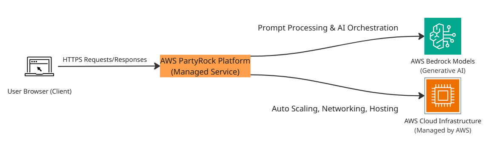
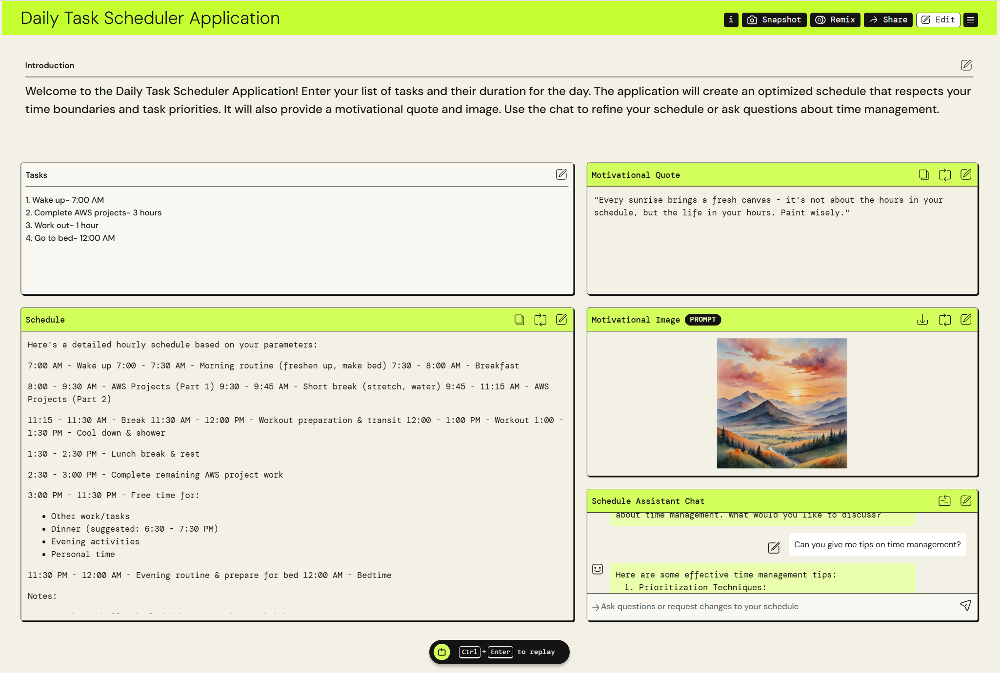

# AWS PartyRock Daily Task Scheduler Application  
A beginner-friendly AI application built using **AWS PartyRock** and powered by **AWS Bedrock**, designed to help users create optimized daily schedules while showcasing prompt engineering, generative AI workflows, and cloud-native deployment.  

## Architecture Overview  
This application is hosted entirely on the AWS PartyRock platform, which abstracts away backend infrastructure while allowing prompt engineering and UI customization.  

  
*Figure 1: High-level architecture of the AWS PartyRock Daily Task Scheduler Application.*  

### Core Components  
- **User Browser (Client)** – Interacts via HTTPS and renders the PartyRock web UI.  
- **AWS PartyRock Platform** – Hosts the application, processes prompts, orchestrates AI models, and automatically scales infrastructure.  
- **AWS Bedrock Models** – Generate schedules, motivational quotes, and images based on user inputs.  
- **AWS Cloud Infrastructure (Managed)** – Networking, scaling, and compute are handled entirely by AWS PartyRock.  

## Key Concepts Demonstrated  
- Designing and implementing generative AI application workflows.  
- Creating multi-step AI processes using prompt chaining.  
- Customizing user interfaces within managed AI platforms.  
- Deploying applications using no-code/low-code AWS services.  

## Features  
- AI-generated daily schedules that respect user time boundaries and priorities.  
- Motivational quotes and AI-generated images for user inspiration.  
- Interactive scheduling assistant for personalized guidance.  
- Shareable via public PartyRock link for collaboration and remixing.  

## Tech Stack  
- **Languages:** N/A (no-code implementation)  
- **AWS Services:** PartyRock, Bedrock  
- **IaC Tools:** N/A (managed service)  
- **Other Tools:** None  

## Deployment Instructions  
*This project does not include an AWS CloudFormation or Terraform template, as AWS PartyRock is a fully managed service and abstracts away backend infrastructure.*  

## How to Use  
1. Open the live application: [Daily Task Scheduler Application](https://partyrock.aws/u/patrick-heese/Q3yFX5XnU/Daily-Task-Scheduler-Application).  
2. Enter your tasks and priorities.  
3. Click **Play** to generate your schedule.  
4. (Optional) Use **Snapshot** to share results or **Remix** to create a custom version.  

## Project Structure  
```plaintext
aws-partyrock-daily-task-scheduler/
├── assets/                     # Images, diagrams, screenshots
│ ├── architecture-diagram.png  # Project architecture
│ └── screenshot.png            # Application screenshot
├── LICENSE                     
├── README.md                   
└── .gitignore                  
```

## Screenshot  
  

## Future Enhancements  
- **Custom AWS Application** – Rebuild the PartyRock functionality using API Gateway, Bedrock, and Lambda for more control and customization.  
- **Infrastructure as Code** – Use CloudFormation or Terraform to provision a reproducible environment.  
- **Data Persistence** – Store generated schedules in DynamoDB or S3 for history tracking.  
- **Advanced Prompt Engineering** – Refine and test prompt strategies for more tailored outputs.  

## License  
This project is licensed under the [MIT License](LICENSE).  

---

## Author  
**Patrick Heese**  
Cloud Administrator | Aspiring Cloud Engineer/Architect  
[LinkedIn Profile](https://www.linkedin.com/in/patrick-heese/) | [GitHub Profile](https://github.com/patrick-heese)  

## Acknowledgments  
This project was inspired by a course from [techwithlucy](https://github.com/techwithlucy).  
The architecture diagram included here is my own version, adapted from the original course diagram.  
I designed and developed all project documentation.  
