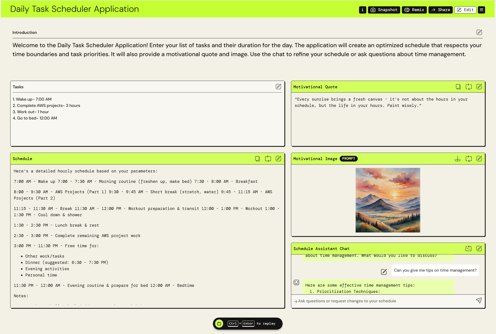

# AWS PartyRock Daily Task Scheduler Application
This beginner-friendly AI application, built using **AWS PartyRock**, showcases generative AI capabilities powered by **AWS Bedrock**. The application helps users create an optimized daily schedule that respects their time boundaries and task priorities. It also provides a motivational quote, an inspiring image, and a schedule assistant for additional guidance, all through a clean, prompt-based interface.

## Screenshot


## Features
- **Custom AI prompts** for generating fun and engaging content.
- **User-friendly interface** with live AI responses.
- **Cloud-native deployment** via AWS PartyRock platform.
- Easily shareable through a public AWS PartyRock link.

## Architecture Overview
This application is hosted entirely on the **AWS PartyRock** platform, which abstracts away backend infrastructure while allowing prompt engineering and UI customization.  

**Core Components:**

1. **User Browser (Client)**  
   - Sends requests via HTTPS.  
   - Renders the PartyRock web UI.

2. **AWS PartyRock Platform (Managed Service)**  
   - Handles application hosting, prompt processing, and AI model orchestration.  
   - Abstracts backend compute and scaling.

3. **Generative AI Models (Bedrock)**  
   - AWS Bedrock foundation models process prompts and generate responses.  
   - No infrastructure management required.

4. **AWS Cloud Infrastructure (Managed by PartyRock)**  
   - Networking, load balancing, and scaling are handled automatically. 

**Key concepts demonstrated:**
- Generative AI application design
- Prompt chaining for interactive workflows
- UI layout customization for multi-input experiences

## Project Structure
```
├── assets/
│ └── screenshot.png # Application screenshot
├── LICENSE # MIT License
├── README.md # Project documentation
└── .gitignore # Git ignored files
```

## How to Use
1. Visit the live app here: [Daily Task Scheduler Application](https://partyrock.aws/u/patrick-heese/Q3yFX5XnU/Daily-Task-Scheduler-Application)
2. Fill in your tasks and press the play button.
3. *(Optional)* Select **Snapshot** to share your input and output with others.
4. *(Optional)* Select **Remix** to copy the application and create your own version.

## Learning Extensions / Future Exploration
- Custom AWS App – Recreate the PartyRock app’s core functionality using Amazon Bedrock + Amazon API Gateway + AWS Lambda, giving full control over architecture and integrations.
- Multi-Service Integration – Experiment with adding data storage via Amazon DynamoDB or Amazon S3 for persistent conversation logs.
- Infrastructure-as-Code – Deploy a recreated app environment using AWS CloudFormation or Terraform to practice IaC principles.
- CI/CD Pipeline – Implement an automated deployment pipeline using AWS CodePipeline or GitHub Actions for continuous integration and delivery.
- Advanced Prompt Engineering – Research and test different prompt strategies to optimize AI-generated responses.

## License
This project is licensed under the [MIT License](LICENSE).

---

### Author
**Patrick Heese**  
Cloud Administrator | Aspiring Cloud Engineer/Architect  
[LinkedIn Profile](https://www.linkedin.com/in/patrick-heese/) | [GitHub Profile](https://github.com/patrick-heese)
